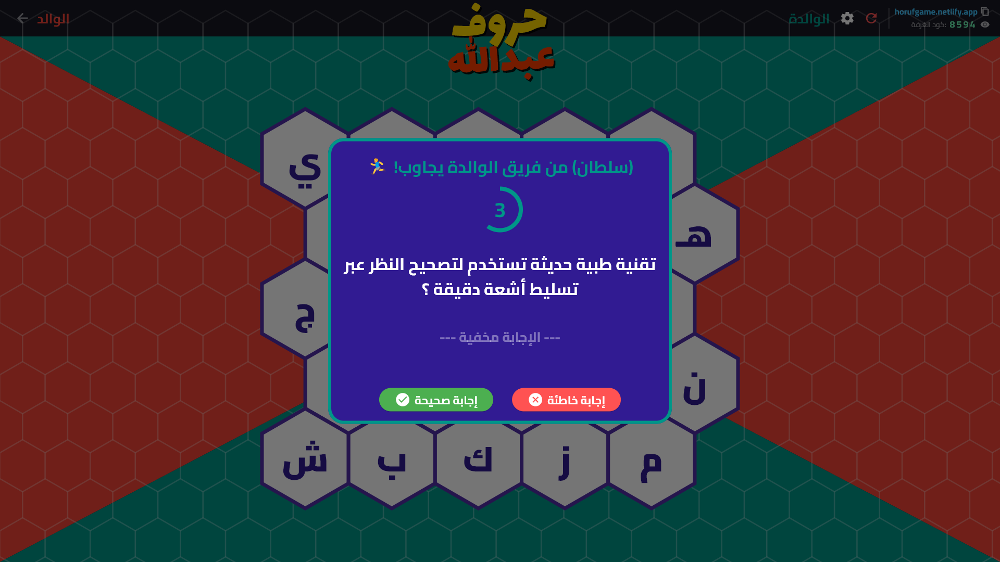

# 🎮 لعبة الحروف | Horouf Game

أهلاً بك في "لعبة الحروف"! ✨ 
لعبة مسابقات تفاعلية مخصصة لأجهزة الكمبيوتر (Desktop Game)، صممناها خصيصاً لتكون نجمة الجمعات، الاستراحات، والبثوث المباشرة (Live Streams). 

الفكرة باختصار: أنت تدير المسابقة من شاشة كمبيوترك بكل فخامة، وأصدقاؤك يتنافسون باستخدام جوالاتهم كـ "أجراس ذكية" مدمجة مع اللعبة!

---

## 📥 تحميل اللعبة (جاهزة للتشغيل)
ما يحتاج تعقيد أو تسطيب! اللعبة جاهزة للعب مباشرة:
1. اذهب إلى قسم **Releases** (الإصدارات) في القائمة الجانبية.
2. حمّل أحدث إصدار متاح لنظامك (ملف `zip`).
3. فك الضغط عن الملف، افتح اللعبة.. وابدأ التحدي فوراً!

---

## ✨ ليش "لعبة الحروف" غير عن أي لعبة ثانية؟

### 🎨 لعبتك.. قواعدك (تخصيص كامل)
حنا نعطيك المنصة، وأنت تصنع المسابقة! 
* **أسئلتك الخاصة:** تقدر تبني بنك أسئلتك بنفسك، تعدل عليه، وتحفظه.
* **هوية الفرق:** سمّ الفرق على كيفك (مثلاً: العيال vs البنات، فريق الدوام vs الاستراحة).
* **ألوان وتعديل فوري:** تقدر تغير ألوان الفرق وقت اللعب عشان تناسب جوكم.

### 📂 استيراد الأسئلة بضغطة زر
عشان ما تتعب في كتابة الأسئلة من الصفر، اللعبة تدعم استيراد بنك أسئلة كامل بصيغة `JSON`. تقدر تجهز أسئلتك براحتك أو تتبادل الملفات الجاهزة مع أصدقائك، وبضغطة زر تتعبى اللعبة بمئات الأسئلة الجاهزة!

### 🔀 أسئلة متجددة وبدون تكرار
اللعبة ذكية وتضمن لك إن السؤال اللي يطلع ما يرجع يتكرر عشان ما يخرب حماس الجولة. وإذا حسيت إنك استهلكت الأسئلة؟ بضغطة زر "خلط" تترتب الأسئلة عشوائياً وتبدأون بتحديات جديدة.

### 🎛️ تحكم مرن بخلايا اللوحة
أخطأت في حسبة نقطة أو تبي تسحب الحرف من فريق؟ بضغطة وحدة على أي خلية في اللوحة تقدر تحولها للفريق الخصم، أو تمسح النتيجة وترجع الخلية متاحة للعب بكل سهولة وسلاسة.

### ⚡ نظام الجرس المدمج (The Smart Buzzer)
وداعاً لطريقة "اللي يرفع يده أول يجاوب"! 
اللعبة مدمج فيها نظام أجراس لحظي. أول ما تبدأ الجولة، اللعبة بتعطيك "كود الغرفة". الشباب يدخلون الكود بجوالاتهم.. وهنا يبدأ الحماس:
* أول ما تفتح السؤال، الأجراس تتفعل عندهم.
* اللي يضغط أول، اللعبة تصيده بأجزاء من الثانية وتكتب اسمه عالشاشة الكبيرة!
* معاه **5 ثواني** بس عشان يجاوب.
* **نظام العقوبات:** جاوب غلط؟ ينقفل الجرس عنه وعن فريقه 10 ثواني عقاب لهم، وتتحول الفرصة للفريق الثاني!

### 👁️ وضع البثوث (Streamer Mode)
لو أنت ستريمر وتلعب مع متابعينك أو أصدقائك بالديسكورد، أكيد ما تبي أحد متطفل يلقط الكود من الشاشة ويدخل يخرب عليكم. لذلك أضفنا أيقونة "عين" صغيرة فوق.. بضغطة زر يتحول الكود لنجوم `****` وتلعبون بخصوصية تامة.

### 🤫 الشاشة السرية للمضيف (Host Dashboard)
بما إنك أنت مدير المسابقة (المضيف)، لازم يكون لك ميزة! اللعبة توفر لك رابط محلي سري تفتحه بجوالك أو متصفحك، يعرض لك السؤال و**الإجابة الصحيحة** عشان تكون أنت الحكم الفاهم والمسيطر على الوضع.

---

## 🎮 كيف تلعبون؟

1. **شغل اللعبة** على جهازك (الكمبيوتر/اللابتوب).
2. اضغط **"ابدأ اللعبة"** واكتب أسماء الفرق.
3. بتطلع لك لوحة اللعب، وفي أعلاها رابط وكود الغرفة.
4. الشباب يدخلون الرابط بجوالاتهم، يكتبون أساميهم والكود، ويختارون فريقهم.
5. افتح الحرف الأول.. وخل الأسرع يفوز! 🔔

---

## 🛠️ التقنيات (Tech Stack)
* **واجهة اللعبة الأساسية:** مبنية باستخدام Flutter / Dart لأداء سلس ورسوميات جذابة على الكمبيوتر.
* **نظام المزامنة والأجراس:** ربط لحظي (Realtime) عن طريق السحابة لنقل ضغطات الجوالات إلى اللعبة مباشرة في أجزاء من الثانية.
* **تخزين البيانات:** نظام حفظ داخلي (Local Storage) لحفظ الأسئلة وسجل الأقيام السابقة لضمان عدم ضياع أي جولة.

---

## 📸 لقطات من داخل اللعبة
---

## 📸 لقطات من داخل اللعبة

  <h3>شاشة القائمة الرئيسية</h3>
  
    
  <h3>لوحة اللعب (GameBoard) - ووضع الستريمر مُفعّل</h3>
  

---
---
**صُممت بحب لتصنع أجمل الذكريات والتحديات! 🚀**
